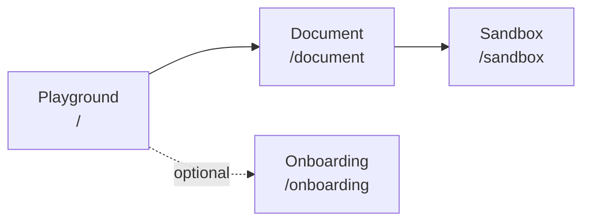
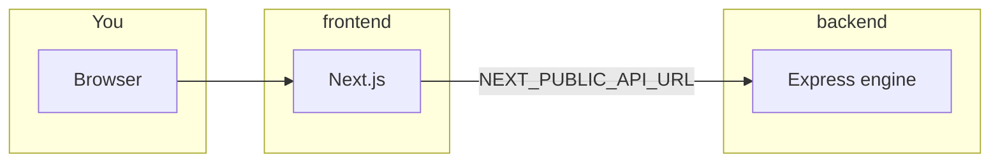

# HarmonyForge

> **In one sentence:** Upload your melody, get rule-based harmonies you can **edit**, **hear**, and **ask questions about**—with a transparent AI engine, not a black-box model.

---

## Start here

| If you want to… | Do this |
|-----------------|--------|
| **Run the app locally** | [Quick start](#quick-start) (two commands) |
| **Understand the folders** | [Repository layout](#repository-layout) and [folder guides](#folder-guides) |
| **Read the roadmap / history** | [docs/README.md](docs/README.md) → `plan.md` + `progress.md` |
| **Work on the website** | [frontend/README.md](frontend/README.md) |
| **Work on harmony / API** | [backend/README.md](backend/README.md) |

---

## What you get (three pieces)

```text
┌─────────────────────┐     ┌─────────────────────┐     ┌─────────────────────┐
│   Logic Core        │     │   Tactile Sandbox   │     │   Theory Inspector  │
│   (backend)         │     │   (Next.js)         │     │   (optional LLM)    │
├─────────────────────┤     ├─────────────────────┤     ├─────────────────────┤
│ Parse files         │     │ Upload & configure  │     │ Explain notes       │
│ Infer chords        │ ──► │ Edit in score       │ ◄─► │ Chat & stylist tips │
│ Solve SATB-style    │     │ Play & export       │     │ Audit highlights    │
│ REST API :8000      │     │ Browser :3000       │     │ Keys in .env.local  │
└─────────────────────┘     └─────────────────────┘     └─────────────────────┘
```

- **You stay the author.** The engine suggests harmonies from **music-theory rules**; the optional LLM **explains** and **suggests**—it does not replace the deterministic output.
- **Inputs:** MusicXML, MIDI, MXL; PDF when the OMR path is set up (still finicky).
- **Not included:** Automatic “AI composer” in the hidden sense, full DAW audio production, or surrendering edit control.

**Ideas behind the project:** expressive sovereignty, copyright-safe axiomatic theory (not copying datasets), and teaching-friendly transparency. Research context: [SALT Lab](https://ischool.illinois.edu/people/yun-huang) (UIUC).

---

## Your journey in the app



| Step | URL | What happens |
|------|-----|----------------|
| 1 | `/` | Upload a score; first-time **Welcome** / **Tour** if you use them |
| 2 | `/document` | Preview, pick mood and instruments, **Generate** harmonies |
| 3 | `/sandbox` | Edit in **RiffScore**, play back, export, open **Theory Inspector** |
| Alt | `/onboarding` | Same as step 1, with onboarding always easy to reach (demos / testing) |

---

## Quick start

```bash
make install    # Installs backend + frontend (and Python bits for PDF/OMR)
make dev        # Engine :8000 + website :3000 together
```

Then open **http://localhost:3000** in your browser.

| Stuck on ports? | One-liner |
|-----------------|-----------|
| Something already using 8000 / 3000 / 3001 | `make dev-clean` then `make dev` again |

**Theory Inspector (optional):** copy [`frontend/.env.example`](frontend/.env.example) → `frontend/.env.local` and add `OPENAI_API_KEY`. The browser talks to the engine via **`NEXT_PUBLIC_API_URL`** (defaults to `http://localhost:8000`).

> **Heads-up:** Install dependencies inside **`backend/`** and **`frontend/`** (or use `make install`). A **`node_modules/`** folder at the **repo root** alone is not a supported setup—there is no root `package.json`.

---

## Repository layout

```text
harmonyforge/
├── Makefile           ← install, dev, test, build, pdfalto, dev-clean
├── README.md          ← you are here
├── backend/           ← harmony engine + HTTP API
├── frontend/          ← Next.js app
├── docs/              ← plans, ADRs, taxonomy, work logs
├── miscellaneous/     ← legacy demo, pdfalto build, helper scripts
└── .cursor/           ← Cursor / AI project rules (optional read)
```



### Folder guides

| Folder | README |
|--------|--------|
| [backend/](backend/) | [backend/README.md](backend/README.md) |
| [frontend/](frontend/) | [frontend/README.md](frontend/README.md) |
| [docs/](docs/) | [docs/README.md](docs/README.md) |
| [miscellaneous/](miscellaneous/) | [miscellaneous/README.md](miscellaneous/README.md) |
| [.cursor/](.cursor/) | [.cursor/README.md](.cursor/README.md) |

---

## Documentation map (short)

| Doc | Best for |
|-----|----------|
| [docs/README.md](docs/README.md) | Full index of every doc file |
| [docs/plan.md](docs/plan.md) | Checklist, M5 study flags, verification |
| [docs/progress.md](docs/progress.md) | Day-to-day log and decisions |
| [docs/context/system-map.md](docs/context/system-map.md) | Architecture diagram |
| [docs/adr/](docs/adr/) | Formal “why we decided X” notes |
| [docs/Taxonomy.md](docs/Taxonomy.md) | Theory vocabulary for the inspector |

---

## Commands (from repo root)

| Command | What it does |
|---------|----------------|
| `make install` | Dependencies for backend + frontend (+ Python for PDF path) |
| `make dev` | Run engine + Next.js together |
| `make dev-backend` | Engine only |
| `make dev-frontend` | Next.js only |
| `make dev-clean` | Free ports 8000, 3000, 3001 + Next dev lock |
| `make test` | Backend Jest tests |
| `make lint` | Backend ESLint |
| `make build` | Compile engine + production Next build |
| `make test-engine` | Sample file through CLI → `backend/output/` |
| `make pdfalto` | Build vendored pdfalto under `miscellaneous/pdfalto/` |

**Frontend only:** `cd frontend && npm run test` and `npm run build`.

---

## Related resources

| Link | What it is |
|------|------------|
| [HarmonyForge LLM Stress Test](https://huggingface.co/spaces/dgeni2/HarmonyForge_LLM_Stress_Test) | LLM vs checker-style evaluation |
| [HF Thematic Analysis Dashboard](https://huggingface.co/spaces/dgeni2/HFThematicAnalysis) | Interview themes that shaped the product |

---

## License

Private. See repository settings.
