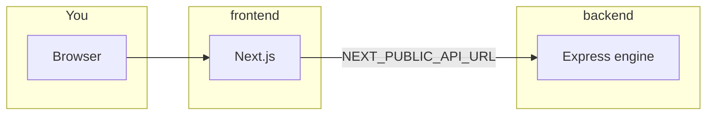

# HarmonyForge

**HarmonyForge** is a *Glass Box* co-creative system for symbolic music arrangement: deterministic, rule-based harmony generation from your melody (MusicXML, MIDI, MXL, PDF when OMR works) so you stay the author and can see *why* the engine chose each harmony move.

## What it is

- **Logic Core** (Node/TypeScript backend): chord inference, SATB-style solver, file intake, REST API on **port 8000**.
- **Tactile Sandbox** (Next.js frontend on **port 3000**): upload → preview + ensemble config → generate → **RiffScore** editor with **`EditableScore`** in Zustand as the canonical model (bidirectional sync). Playback, export, **Theory Inspector** (note explain, chat, stylist suggestions, SATB audit with highlights on the score).
- **Theory Inspector** uses optional LLMs as **explainers and suggestors** only; it does not invent the primary harmony output. Configure keys in [`frontend/.env.example`](frontend/.env.example) (`OPENAI_API_KEY`, optional `OPENAI_BASE_URL` / `OPENAI_URL`).

**Principles:** expressive sovereignty · copyright-safe axiomatic theory (not dataset mimicry) · pedagogical transparency.

## What it is not

Not a black-box neural harmonizer, not audio synthesis, and not “hands-off” automation—the app keeps **edit authority** with you.

## Research context

[SALT Lab](https://ischool.illinois.edu/people/yun-huang) (UIUC). Motivation: reduce the **repair-phase bottleneck** after probabilistic tools by pairing a **transparent engine** with a tactile workspace and inspector. See **Related resources** below for empirical and thematic studies.

## User flow

| Step | Route | What you do |
|------|--------|-------------|
| Playground | `/` | Upload score; optional **Welcome** / **Tour** in header; first visit **onboarding modal** |
| Standalone onboarding | `/onboarding` | Same upload flow with onboarding modal always available (demo / testing) |
| Document | `/document` | Preview, mood/genre/instruments, **Generate** (or melody-only in M5 reviewer arm) |
| Sandbox | `/sandbox` | Edit in **RiffScore**, playback, export, **Theory Inspector** |

## Quick start

```bash
make install       # backend/ + frontend/ deps (and Python deps for PDF/OMR tooling)
make dev           # backend :8000 + Next :3000
```

Open **http://localhost:3000**.

```bash
make dev-clean     # Free ports 8000 / 3000 / 3001 if something is stuck
make test-engine   # CLI: sample input → backend/output/
```

**Environment:** copy [`frontend/.env.example`](frontend/.env.example) to `.env.local` for Theory Inspector. **`NEXT_PUBLIC_API_URL`** should point at the engine (default `http://localhost:8000`) for browser calls.

**Note:** Prefer **`make install`** in **`backend/`** and **`frontend/`**. A stray **`node_modules/`** at the repo root is not the supported layout (there is no root `package.json`).

## Repository layout

```text
harmonyforge/
├── Makefile              # install, dev, test, build, pdfalto, dev-clean
├── README.md             # this file
├── backend/              # → backend/README.md — engine + HTTP API
├── frontend/             # → frontend/README.md — Next.js app
├── docs/                 # → docs/README.md — plans, ADRs, taxonomy, logs
├── miscellaneous/        # → miscellaneous/README.md — legacy stack, pdfalto, scripts
└── .cursor/              # → .cursor/README.md — editor/AI rules (optional)
```



### Folder guides

| Folder | README |
|--------|--------|
| [backend/](backend/) | [backend/README.md](backend/README.md) |
| [frontend/](frontend/) | [frontend/README.md](frontend/README.md) |
| [docs/](docs/) | [docs/README.md](docs/README.md) |
| [miscellaneous/](miscellaneous/) | [miscellaneous/README.md](miscellaneous/README.md) |
| [.cursor/](.cursor/) | [.cursor/README.md](.cursor/README.md) |

## Documentation index

Living roadmap and history live under **`docs/`**. Start with **[docs/README.md](docs/README.md)** for a full file index, then:

- **[docs/plan.md](docs/plan.md)** — objectives, checklist, M5 study flags  
- **[docs/progress.md](docs/progress.md)** — work log, session notes, gaps  
- **[docs/context/system-map.md](docs/context/system-map.md)** — architecture diagram  
- **[docs/adr/](docs/adr/)** — architectural decision records  
- **[docs/Taxonomy.md](docs/Taxonomy.md)** — theory lexicon for the inspector  

## Commands

| Command | Description |
|---------|-------------|
| `make install` | Install `backend/` + `frontend/` (and Python deps for PDF/OMR) |
| `make dev` | Backend + frontend |
| `make dev-backend` | Backend only |
| `make dev-frontend` | Frontend only |
| `make dev-clean` | Kill listeners on 8000, 3000, 3001; clear Next dev lock |
| `make test` | Backend Jest (`engine/`) |
| `make lint` | Backend ESLint |
| `make build` | Engine `tsc` + Next production build |
| `make test-engine` | CLI sample through engine |
| `make pdfalto` | Build vendored pdfalto under `miscellaneous/pdfalto/` |

Frontend-only: `cd frontend && npm run test` · `npm run build`.

## Related resources

| Resource | Description |
|----------|-------------|
| [**HarmonyForge LLM Stress Test**](https://huggingface.co/spaces/dgeni2/HarmonyForge_LLM_Stress_Test) | LLM harmonic attempts vs checker-style evaluation |
| [**HF Thematic Analysis Dashboard**](https://huggingface.co/spaces/dgeni2/HFThematicAnalysis) | Interview themes informing design |

## License

Private. See repository settings.
