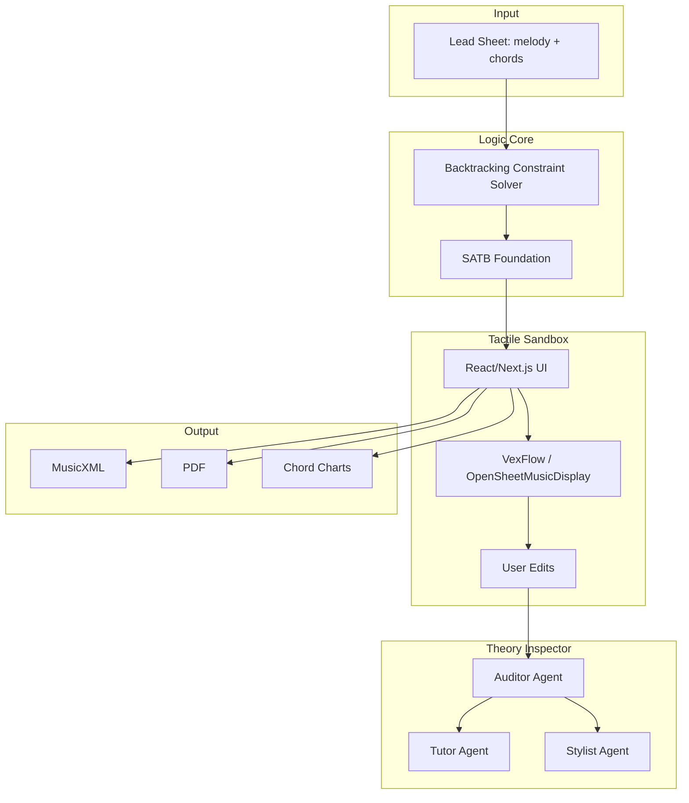

# System Map

> **Implementation status:** Logic Core (engine/) complete. Generate Harmonies flow wired: Document → API → Sandbox. **Additive harmonies:** Engine adds harmony parts to melody (melody + flute + cello = 3 parts). **Output:** Partwise MusicXML 2.0 (MuseScore/OSMD compatible). **Parser:** MusicXML partwise via fast-xml-parser (no DTD); extracts `melodyPartName`. **Display:** View mode (OSMD) and Edit mode (VexFlow) toggle; session persistence (sessionStorage); CORS via `CORS_ORIGIN`. **Audio playback:** usePlayback hook + playbackUtils; issues remain (runtime, wrong notes). **CLI:** `make test-engine` with `-i`, `-o`, `--mood`, `--instruments`. Theory Inspector pending. See `@progress.md`.

## Overview

HarmonyForge is a three-stage Glass Box architecture for symbolic music arrangement.

**Repository layout:**
- `harmony-forge-redesign/` — Tactile Sandbox frontend (Next.js); design system, Theory Inspector UI, Score Canvas
- `docs/` — Plan, progress, ADRs, context
- `Taxonomy.md` — RAG lexicon for Theory Inspector It replaces probabilistic AI with deterministic constraint-satisfaction logic and an explainable Theory Inspector.

## Components

| Component | Role | Tech |
|-----------|------|------|
| **Logic Core** | Deterministic constraint-satisfaction solver; generates valid SATB from lead sheet; variable parts (selected instruments only) | Node.js, TypeScript |
| **Tactile Sandbox** | Interactive notation editor; direct manipulation, Edit-Authority. **Display:** View mode (OSMD) and Edit mode (VexFlow) toggle; session persistence for Sandbox. **Audio:** usePlayback + Tone.js (issues: runtime, wrong notes). **Lives in** `harmony-forge-redesign/` | Next 16, React 19, Tailwind, OSMD, VexFlow, Tone, Zustand |
| **Theory Inspector** | Multi-agent LLM: Auditor (validate), Tutor (explain), Stylist (suggest). RAG retrieves from [Taxonomy.md](../../Taxonomy.md). | GPT-4o API |

## Data Flow

1. **Input**: User uploads score as **XML, MIDI, or PDF** (PDF: 501 for MVP; use XML/MIDI).
2. **Document page**: Left pane parses uploaded MusicXML client-side and renders preview; right pane Ensemble Builder for mood + instruments. Generate Harmonies → POST to backend.
3. **Parse & normalize**: Backend converts to canonical format (ParsedScore); extracts melody, `melodyPartName`, key, chords (or infers chords using mood). fast-xml-parser for score-partwise (avoids DTD loading).
4. **Generation**: Backend solver processes ParsedScore + config (mood affects chord inference) → outputs valid SATB. **Additive harmonies:** melody stays as Part 1; selected instruments (flute, cello) added as harmony parts (Alto, Bass voices).
5. **Output**: Backend returns **partwise MusicXML 2.0** (melody + harmony parts, MuseScore/OSMD compatible) for Tactile Sandbox / note editor.
6. **Frontend**: MusicXML → View mode (OSMD) or Edit mode (VexFlow) per Sandbox toggle; session persistence for generatedMusicXML; CORS configurable. Sandbox playback bar uses `sourceFileName`; audio via usePlayback (Tone.js) — issues remain. Partwise passed through; timewise via `timewiseToPartwise.ts`.
7. **Explainability**: Deltas + natural language queries → Auditor/Tutor/Stylist. RAG from `Taxonomy.md`.
8. **Export**: MusicXML, PDF, chord charts, tablature.

## Entry Points

- **API**: REST endpoints for solver (POST lead sheet → SATB JSON).
- **UI** (`harmony-forge-redesign/src/app/`): Three-step flow — `/` Playground (upload) → `/document` Config (mood, instruments) → `/sandbox` Edit (ScoreCanvas, Theory Inspector, Export). Upload, generate, edit, export.
- **Theory Inspector**: Triggered by symbolic state changes; user queries flagged notes. RAG source: `Taxonomy.md` (genre-specific lexicons extracted from HFLitReview).
