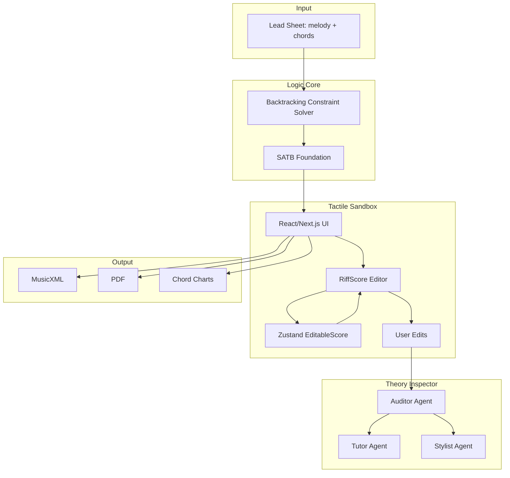

# System Map

> **Implementation status:** Logic Core (`engine/`) complete. Flow: Document → `POST /api/generate-from-file` → Sandbox. **`POST /api/to-preview-musicxml`** — intake → single-part preview MusicXML for Document when upload is **PDF / MXL / MIDI** (Playground stores result in **`useUploadStore.previewMusicXML`**). **PDF→melody via oemer is unresolved** in practice (checkpoints, Python 3.10–12, HTTPS); wiring and diagnostics exist — see **`@progress.md` → Multi-format intake & PDF → Document preview** (primary product failure unchanged). **Additive harmonies** preserved in output. **Clefs:** Engine `satbToMusicXML.ts` emits per-part `<clef>` from instrument name + SATB voice; frontend `musicxmlParser.ts` infers clef from part name **before** fixed `P1–P4` defaults. **Theory sources in code/docs:** `Taxonomy.md` + `harmony-forge-redesign/src/lib/ai/taxonomyIndex.ts` define **Open Music Theory** (primary RAG pedagogy), **Aldwell & Schachter** (hard SATB constraints in `constraints.ts` / trace), **Fux** (motion heuristic **lineage** only—`solver.ts` uses L1 MIDI sum, not species counterpoint), **Caplin** (vocabulary; no full segmentation in primary `engine/`). **Sandbox editor (current):** **RiffScore** in `harmony-forge-redesign/` with **`EditableScore`** in Zustand; `riffscoreAdapter` + `useRiffScoreSync` + `normalizeScoreRests`. **RiffScore forkless extension:** `patch-package` applies `patches/riffscore+*.patch` — **`ui.toolbarPlugins`** (plugin button state props) **and** **playback alignment** for scrub: **`globalThis.__HF_RIFFSCORE_PLAY_FROM`**, **`consumeHfRiffScorePendingPlay()`** in **`handlePlayToggle`** / **`handlePlayback`** (toolbar **Play**, **Space**, **P**); HarmonyForge **`PlaybackScrubOverlay`**, **`playbackScrub.ts`**, **`riffscorePlaybackBridge.ts`** (see **`@docs/progress.md` → Playback scrub**). **Legacy:** VexFlow/OSMD paths still exist in repo history and some preview surfaces; **primary editing path is RiffScore.** **Theory Inspector:** `/api/theory-inspector` (+ `theoryInspectorNoteMode` for note-click tutor), `/api/theory-inspector/suggest`; **fixed LLM audience depth** — **`intermediate`** via **`harmony-forge-redesign/src/lib/ai/explanationLevel.ts`** (**`DEFAULT_EXPLANATION_LEVEL`**, **`resolveExplanationLevel`**; no Beginner/Intermediate/Professional toggle in UI or Zustand); **`POST /api/validate-satb-trace`** for trace-backed highlights; **dual-mode** Origin Justifier vs Harmonic Guide vs melody-context (`theoryInspectorMode.ts`, `Note.originalGeneratedPitch` + Zustand baseline)—**UI:** tutor summary, **What the tool first wrote**, **What this click means** (short prose), **Verifiable score export** (FACT monospace block). **Note-click LLM:** streamed text split in **`noteInsightAiSplit.ts`** into **`aiExplanation`** + **`aiSuggestions`** after delimiter `<<<SUGGESTIONS>>>`. **Free-form chat:** same panel + composer; **`streamingMessageId`** for chat-only typing. **Editor focus + text “score view” for LLM:** **`InspectorScoreFocus`** → **`sendMessage`** POSTs **`scoreSelectionContext`** and **prepends** FACT text to the **user message**; **`buildSystemPrompt`** appends **Editor focus**. **Follow-up fix (2026-04-04):** **`conversationHistory`** built **before** adding the new user bubble—avoids **two consecutive `user`** API messages (plain then full export). **Note-click tutor** POSTs **`userMessage`** = **exported notation first**, then **Response rules**. No staff images—structured strings only. **Markdown:** **`react-markdown`** via **`MarkdownText.tsx`** in **`ChatBubble`** (user/ai) and key **`TheoryInspectorPanel`** blocks. **Region FACTs:** **`regionExplainContext.ts`**. **Canvas:** **Bars** strip + **clickable staff labels** → **`selectAll`**, **green** **focus** overlays. **`TheoryInspectorPanel`:** **This measure** / **This part** card. **`noteExplainContext.ts`** — roster, vertical snapshot, **intervals**, **`describeNotationForTutor`**, **full-bar appendix**; **5+ staves** additive. **`runAudit`** still four-staff mapping without `requireExactlyFourParts`. **Dark theme:** **`ChatBubble`** + **`SandboxPlaybackBar`** use **`hf-*`** tokens. **`lib/ai/prompts.ts`** — **`CITATION_AND_BREVITY`** + **`HONESTY_NO_SYCOPHANCY`**. **Panel scroll:** **`useLayoutEffect` (no deps)**. **Tests:** vitest (`noteExplainContext`, `noteInsightAiSplit`, `regionExplainContext`). **Risks:** residual LLM variance / stale focus; **PDF OMR** fragile; RiffScore **404** samples; **`make lint-frontend`** debt. See **`@progress.md`** **Work log — Tutor follow-up + panels + markdown (2026-04-04)** and earlier LLM / editor-focus logs.

## Overview

HarmonyForge is a three-stage Glass Box architecture for symbolic music arrangement.

**Repository layout:**
- `harmony-forge-redesign/` — Tactile Sandbox frontend (Next.js); RiffScore-based score editor, Theory Inspector UI, `patch-package` for `riffscore`
- `docs/` — Plan, progress, ADRs, context
- `Taxonomy.md` — RAG lexicon for Theory Inspector; **source spine** maps treatises (Fux, Aldwell & Schachter, Caplin, Open Music Theory) to **engine behavior** vs pedagogy-only; mirrored in `harmony-forge-redesign/src/lib/ai/taxonomyIndex.ts`; LLM **`prompts.ts`** — concise citations + **non-sycophantic** honesty when `OPENAI_API_KEY` is set.

## Components

| Component | Role | Tech |
|-----------|------|------|
| **Logic Core** | Deterministic constraint-satisfaction solver; generates valid SATB from lead sheet; variable parts (selected instruments only). **Intake:** `intakeFileToParsedScore` (MusicXML/MXL/MIDI/PDF). **APIs:** `generate-from-file`, **`to-preview-musicxml`** (preview MusicXML for Document). **PDF OMR:** environment-dependent (**oemer**). | Node.js, TypeScript |
| **Tactile Sandbox** | **RiffScore**-centric notation editor; `EditableScore` ↔ RiffScore sync; rest normalization; native toolbar plugins + **scrub-to-play** bridge (patched `riffscore` + `PlaybackScrubOverlay`). Session persistence; onboarding tour. **Note:** RiffScore built-in playback may 404 on `/audio/piano/*.mp3` until static assets exist; **dual Tone paths** (API vs internal `playScore`) — scrub uses pending global consumed on play. **Lives in** `harmony-forge-redesign/` | Next 16, React 19, Tailwind, RiffScore, Zustand, patch-package |
| **Theory Inspector** | **Note explain** + **free-form chat** in one panel (`messages` + composer); **QuickReplyChips** only when present in message history. SATB audit via **`/api/validate-satb-trace`** + local fallback; **harmony-only** highlights/suggest; note-click: **What the tool first wrote**, **What this click means** (short prose from `describeNotationForTutor`), **Verifiable score export** (FACT lines), **Tutor summary**, **Ideas to try next** (`aiSuggestions` / `noteInsightAiSplit.ts`); tutor `theoryInspectorNoteMode`. **Audience depth:** fixed **`intermediate`** for LLM prompts (**`DEFAULT_EXPLANATION_LEVEL`**, **`resolveExplanationLevel`** on **`/api/theory-inspector`** + **`/suggest`**); **no** Beginner/Intermediate/Professional UI toggle or Zustand **`explanationLevel`**. **LLM “view” of score:** **text export**—**`SCORE_DIGEST`**, **`FACT: AUTHORITATIVE NOTATION`**, **`FULL BAR`**; **note stream** = evidence **before** response rules; **follow-up chat** **prepends** FACT block and uses **`conversationHistory` without the in-flight user message** (2026-04-04) so the API is not sent two consecutive `user` turns. **Editor focus:** **`inspectorScoreFocus`** + **`scoreSelectionContext`** + **Editor focus** in **`prompts.ts`**; **measure/part** from **`regionExplainContext.ts`**; **This measure / This part** card. **Markdown:** **`MarkdownText.tsx`** (`react-markdown`) for chat bubbles + tutor blocks. RAG + **`CITATION_AND_BREVITY`** + **`HONESTY_NO_SYCOPHANCY`**. **`streamingMessageId`** → chat-only typing. Panel autoscroll: **`useLayoutEffect` without deps**. **Risk:** residual model/stale-focus issues—see **`@progress.md`**. | Next.js API routes, `Taxonomy.md`, `taxonomyIndex.ts`, `explanationLevel.ts`, `useTheoryInspector.ts`, `useTheoryInspectorStore.ts`, `TheoryInspectorPanel.tsx`, `MarkdownText.tsx`, `noteInsightAiSplit.ts`, `regionExplainContext.ts`, `noteExplainContext.ts`, `theoryInspectorBaseline.ts`, `theoryInspectorSlots.ts`, `prompts.ts`, `ChatBubble.tsx`, `SandboxPlaybackBar.tsx` |
| **RiffScore canvas (labels + inspector chrome)** | Maps each rendered staff to **`EditableScore.parts[].name`** via SVG `g.staff` geometry; fallback list if layout mismatch. With Theory Inspector open: **Bars** strip (measure focus), **clickable** part labels (whole-part focus), **green focus highlights** for selected region note ids. | `riffscorePositions.ts` (`extractStaffLabelLayout`), `RiffScoreEditor.tsx`, `ScoreCanvas.tsx` |

## Data Flow

1. **Input**: User uploads **MusicXML (.xml/.musicxml), MXL, MIDI, or PDF** (dropzone). Backend **`intakeFileToParsedScore`** (`engine/parsers/fileIntake.ts`): ZIP sniff (MXL mislabeled as `.xml`), then extension routing; **PDF** = pdfalto (ALTO + embedded MusicXML text) → Poppler `pdftoppm` (page 1) → **oemer** OMR → internal `ParsedScore`. Host needs **pdfalto** binary, **Poppler**, **Python oemer** stack (`requirements.txt`, optional **`PDFALTO_BIN` / `POPPLER_PDFTOPPM` / `OEMER_BIN`**). **`dev:backend`** prepends Homebrew to **PATH** on macOS. **Unresolved:** **oemer** often fails until checkpoints + Python 3.10–12 venv are set; see `@progress.md`.
2. **Document page**: **`.xml`/`.musicxml`:** FileReader → `parseMusicXML` → ScorePreviewPanel (RiffScore). **`pdf`/`.mxl`/`.mid`/`.midi`:** Playground already called **`POST /api/to-preview-musicxml`**; preview string in **`useUploadStore.previewMusicXML`**; Document parses like XML when present. If preview intake fails, user sees error on Playground (in-page panel) and file is cleared. Right pane: Ensemble Builder → **Generate Harmonies** → **`POST /api/generate-from-file`** (same intake as preview).
3. **Parse & normalize**: Backend converts to canonical format (ParsedScore); extracts melody, `melodyPartName`, key, chords (or infers chords using mood). fast-xml-parser for score-partwise (avoids DTD loading).
4. **Generation**: Backend solver processes ParsedScore + config (mood affects chord inference) → outputs valid SATB. **Additive harmonies:** melody stays as Part 1; selected instruments (flute, cello) added as harmony parts (Alto, Bass voices).
5. **Output**: Backend returns **partwise MusicXML 2.0** (melody + harmony parts, MuseScore/OSMD compatible) for Tactile Sandbox / note editor.
6. **Frontend (Sandbox):** Generated MusicXML → parsed → `EditableScore` → **RiffScore** display/edit; changes pulled back into Zustand. Session persistence for `generatedMusicXML`; CORS configurable.
7. **Explainability:** **Free-form chat** (composer) or legacy chip-driven flows → `/api/theory-inspector` (optional stream) with **`getTaxonomyContext`**; body may omit **`explanationLevel`** — server uses **`resolveExplanationLevel`** (**`intermediate`** default); **`sendMessage`** includes **`scoreSelectionContext`** (and **`theoryInspectorNoteMode`** when focus is a **note**) built from **`inspectorScoreFocus`**; **system prompt** includes **Editor focus** when that string is non-empty; **user message** for chat **prepends** the same FACT block. **`conversationHistory`** for chat is snapshotted **before** the new user message is stored (2026-04-04) so the OpenAI message list does not end with a **plain** user turn immediately before the **enriched** user turn. SATB audit/highlights prefer **`POST /api/validate-satb-trace`**; structured fixes via `/api/theory-inspector/suggest` when API key present; **harmony note click** → baseline + `originalGeneratedPitch` gate → dual-mode FACTs + **`SCORE_DIGEST` / AUTHORITATIVE / FULL BAR** → **Tutor** stream: **notation export first**, then rules → split into **summary** + **suggestions** (`<<<SUGGESTIONS>>>`); **measure / part** focus → **`buildMeasureFocusFacts` / `buildPartFocusFacts`** + green **focus** overlays. Panel: **Tutor summary** / **Ideas** / origin / **What this click means** / **Verifiable score export** **above** chat list; **This measure / This part** when region-focused. **`MarkdownText`** renders `**bold**` etc. in chat and key panels. `noteExplainContext` **staff roster**, intervals, **full-bar dump**. **Gaps:** (a) Roman-numeral per slot not on client; (b) audit vs 5+ staves; (c) Mode A rationale thin without engine metadata; (d) offline = taxonomy fallback; (e) scroll-every-render tradeoff; (f) **PDF→MusicXML** / **oemer**; (g) **residual tutor quality** (stale focus if user edits after click; optional live evidence refresh on send not implemented).
8. **Export**: MusicXML, PDF, chord charts, tablature.

## Entry Points

- **API**: REST endpoints for solver (POST lead sheet → SATB JSON).
- **UI** (`harmony-forge-redesign/src/app/`): Three-step flow — `/` Playground (upload) → `/document` Config (mood, instruments) → `/sandbox` Edit (ScoreCanvas, Theory Inspector, Export). Upload, generate, edit, export.
- **Theory Inspector**: Triggered by symbolic state changes; user queries flagged notes. RAG: `Taxonomy.md` + `taxonomyIndex.ts` (genre sections + violation entries; source–engine mapping in classical blob). LLM: `prompts.ts` — `CITATION_AND_BREVITY` + `HONESTY_NO_SYCOPHANCY` when API key present.
