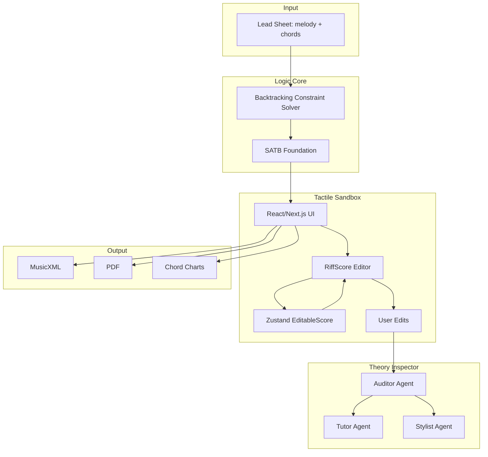

# System Map

> **Implementation status:** Logic Core (`engine/`) complete. Flow: Document → `POST /api/generate-from-file` → Sandbox. **Additive harmonies** preserved in output. **Clefs:** Engine `satbToMusicXML.ts` emits per-part `<clef>` from instrument name + SATB voice; frontend `musicxmlParser.ts` infers clef from part name **before** fixed `P1–P4` defaults. **Theory sources in code/docs:** `Taxonomy.md` + `harmony-forge-redesign/src/lib/ai/taxonomyIndex.ts` define **Open Music Theory** (primary RAG pedagogy), **Aldwell & Schachter** (hard SATB constraints in `constraints.ts` / trace), **Fux** (motion heuristic **lineage** only—`solver.ts` uses L1 MIDI sum, not species counterpoint), **Caplin** (vocabulary; no full segmentation in primary `engine/`). **Sandbox editor (current):** **RiffScore** in `harmony-forge-redesign/` with **`EditableScore`** in Zustand; `riffscoreAdapter` + `useRiffScoreSync` + `normalizeScoreRests`. **RiffScore forkless extension:** `patch-package` applies `patches/riffscore+*.patch` (`ui.toolbarPlugins`, plugin button state props). **Legacy:** VexFlow/OSMD paths still exist in repo history and some preview surfaces; **primary editing path is RiffScore.** **Theory Inspector:** `/api/theory-inspector` (+ `theoryInspectorNoteMode` for note-click tutor), `/api/theory-inspector/suggest`; **`POST /api/validate-satb-trace`** for trace-backed highlights; **dual-mode** Origin Justifier vs Harmonic Guide (`theoryInspectorMode.ts`, `Note.originalGeneratedPitch` + Zustand baseline); **`lib/ai/prompts.ts`** — LLM personas use **`CITATION_AND_BREVITY`** + **`HONESTY_NO_SYCOPHANCY`** (brief citations, no sycophancy, realistic limits); **`noteExplainContext.ts`** — staff roster (input vs generated `part.name`), same-beat vertical snapshot, **cross-part intervals** from clicked pitch to every other staff, SATB slot motion + named staves via `resolveSatbPartIndices`; **note explain** uses SATB slots only when **`score.parts.length === 4`** (`scoreToAuditedSlots(..., { requireExactlyFourParts: true })`); **5+ staves** use full additive FACTs. **`runAudit`** still calls `scoreToAuditedSlots(score)` without that flag (four-staff mapping). OpenAI optional via `OPENAI_API_KEY`. **Tests:** `harmony-forge-redesign` → `npm run test` (vitest). **Known dev gap:** RiffScore `/audio/piano/*.mp3` → **404**. **CLI:** `make test-engine`. See `@progress.md` consolidated 2026-04 section and **Work completed (2026-04)**.

## Overview

HarmonyForge is a three-stage Glass Box architecture for symbolic music arrangement.

**Repository layout:**
- `harmony-forge-redesign/` — Tactile Sandbox frontend (Next.js); RiffScore-based score editor, Theory Inspector UI, `patch-package` for `riffscore`
- `docs/` — Plan, progress, ADRs, context
- `Taxonomy.md` — RAG lexicon for Theory Inspector; **source spine** maps treatises (Fux, Aldwell & Schachter, Caplin, Open Music Theory) to **engine behavior** vs pedagogy-only; mirrored in `harmony-forge-redesign/src/lib/ai/taxonomyIndex.ts`; LLM **`prompts.ts`** — concise citations + **non-sycophantic** honesty when `OPENAI_API_KEY` is set.

## Components

| Component | Role | Tech |
|-----------|------|------|
| **Logic Core** | Deterministic constraint-satisfaction solver; generates valid SATB from lead sheet; variable parts (selected instruments only) | Node.js, TypeScript |
| **Tactile Sandbox** | **RiffScore**-centric notation editor; `EditableScore` ↔ RiffScore sync; rest normalization; native toolbar plugins (patched `riffscore`). Session persistence; onboarding tour. **Note:** RiffScore built-in playback may 404 on `/audio/piano/*.mp3` until static assets exist. **Lives in** `harmony-forge-redesign/` | Next 16, React 19, Tailwind, RiffScore, Zustand, patch-package |
| **Theory Inspector** | Chat + chips; SATB audit via **`/api/validate-satb-trace`** + local fallback (see **audit vs explain** split on 5+ part scores in `@progress.md`); **harmony-only** highlights/suggest; note-click: **roster + multi-staff intervals + dual-mode** FACTs (`noteExplainContext.ts`, `theoryInspectorMode.ts`); tutor `theoryInspectorNoteMode`; RAG + **`CITATION_AND_BREVITY`** + **`HONESTY_NO_SYCOPHANCY`** in `prompts.ts` when OpenAI on. | Next.js API routes, `Taxonomy.md`, `taxonomyIndex.ts`, `NEXT_PUBLIC_ENGINE_URL`, `useTheoryInspector.ts`, `theoryInspectorBaseline.ts`, `theoryInspectorSlots.ts`, `prompts.ts` |

## Data Flow

1. **Input**: User uploads score as **XML, MIDI, or PDF** (PDF: 501 for MVP; use XML/MIDI).
2. **Document page**: Left pane parses uploaded MusicXML client-side and renders preview; right pane Ensemble Builder for mood + instruments. Generate Harmonies → POST to backend.
3. **Parse & normalize**: Backend converts to canonical format (ParsedScore); extracts melody, `melodyPartName`, key, chords (or infers chords using mood). fast-xml-parser for score-partwise (avoids DTD loading).
4. **Generation**: Backend solver processes ParsedScore + config (mood affects chord inference) → outputs valid SATB. **Additive harmonies:** melody stays as Part 1; selected instruments (flute, cello) added as harmony parts (Alto, Bass voices).
5. **Output**: Backend returns **partwise MusicXML 2.0** (melody + harmony parts, MuseScore/OSMD compatible) for Tactile Sandbox / note editor.
6. **Frontend (Sandbox):** Generated MusicXML → parsed → `EditableScore` → **RiffScore** display/edit; changes pulled back into Zustand. Session persistence for `generatedMusicXML`; CORS configurable.
7. **Explainability:** User query or chip → `/api/theory-inspector` (optional stream) with **`getTaxonomyContext`** (`taxonomyIndex.ts` ← `Taxonomy.md` spine); SATB audit/highlights prefer **`POST /api/validate-satb-trace`** on engine; structured fixes via `/api/theory-inspector/suggest` when API key present; **harmony note click** → baseline + `originalGeneratedPitch` gate → **Origin Justifier** or **Harmonic Guide** → `noteExplainContext` **staff roster**, same-beat snapshot per **`part.name`**, **intervals from clicked pitch to each other staff**, SATB prev/next slot motion when exactly four parts; evidence + `theoryInspectorNoteMode` → **Auditor/Tutor** system prompts (**cited** norms when appropriate; **concise**; **realistic**—no flattery, admit thin context, checker ≠ musical ideal). In-score highlights for **generated harmonies** only. **Gaps:** (a) Roman-numeral per slot not on client; (b) **audit** may still target four mapped staves on large scores while **note explain** lists all staves; (c) Mode A “generative rationale” beyond violation trace is still thin without engine metadata; (d) offline mode = taxonomy text only, no LLM phrasing.
8. **Export**: MusicXML, PDF, chord charts, tablature.

## Entry Points

- **API**: REST endpoints for solver (POST lead sheet → SATB JSON).
- **UI** (`harmony-forge-redesign/src/app/`): Three-step flow — `/` Playground (upload) → `/document` Config (mood, instruments) → `/sandbox` Edit (ScoreCanvas, Theory Inspector, Export). Upload, generate, edit, export.
- **Theory Inspector**: Triggered by symbolic state changes; user queries flagged notes. RAG: `Taxonomy.md` + `taxonomyIndex.ts` (genre sections + violation entries; source–engine mapping in classical blob). LLM: `prompts.ts` — `CITATION_AND_BREVITY` + `HONESTY_NO_SYCOPHANCY` when API key present.
