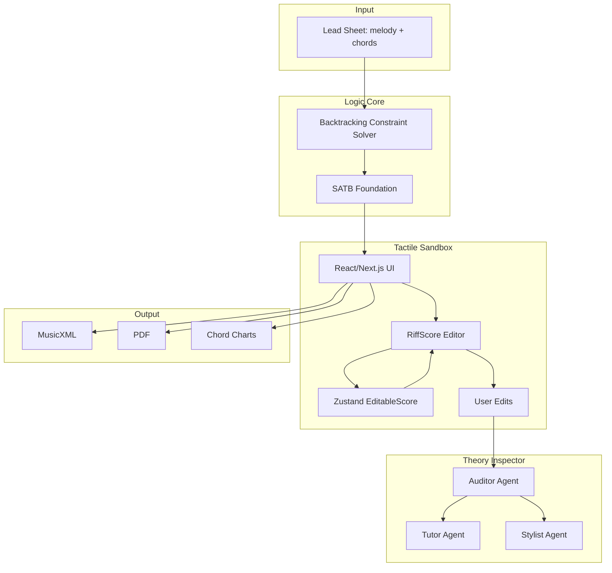

# System Map

> **Implementation status:** Logic Core (`engine/`) complete. Flow: Document → `POST /api/generate-from-file` → Sandbox. **Additive harmonies** preserved in output. **Sandbox editor (current):** **RiffScore** in `harmony-forge-redesign/` with **`EditableScore`** in Zustand; `riffscoreAdapter` + `useRiffScoreSync` + `normalizeScoreRests`. **RiffScore forkless extension:** `patch-package` applies `patches/riffscore+*.patch` (`ui.toolbarPlugins`, plugin button state props). **Legacy:** VexFlow/OSMD paths still exist in repo history and some preview surfaces; **primary editing path is RiffScore.** **Theory Inspector:** `/api/theory-inspector`, `/api/theory-inspector/suggest`; explains **harmony parts only**; inline highlights + ghost suggestions; OpenAI optional via `OPENAI_API_KEY` in `.env.local` (see `.env.example`). **Known dev gap:** RiffScore requests `/audio/piano/*.mp3` → **404** until assets are served. **CLI:** `make test-engine`. See `@progress.md` consolidated 2026-04 section.

## Overview

HarmonyForge is a three-stage Glass Box architecture for symbolic music arrangement.

**Repository layout:**
- `harmony-forge-redesign/` — Tactile Sandbox frontend (Next.js); RiffScore-based score editor, Theory Inspector UI, `patch-package` for `riffscore`
- `docs/` — Plan, progress, ADRs, context
- `Taxonomy.md` — RAG lexicon for Theory Inspector; it replaces probabilistic AI with deterministic constraint-satisfaction logic and an explainable Theory Inspector.

## Components

| Component | Role | Tech |
|-----------|------|------|
| **Logic Core** | Deterministic constraint-satisfaction solver; generates valid SATB from lead sheet; variable parts (selected instruments only) | Node.js, TypeScript |
| **Tactile Sandbox** | **RiffScore**-centric notation editor; `EditableScore` ↔ RiffScore sync; rest normalization; native toolbar plugins (patched `riffscore`). Session persistence; onboarding tour. **Note:** RiffScore built-in playback may 404 on `/audio/piano/*.mp3` until static assets exist. **Lives in** `harmony-forge-redesign/` | Next 16, React 19, Tailwind, RiffScore, Zustand, patch-package |
| **Theory Inspector** | Chat + chips; SATB audit via engine; **harmony-only** highlights and suggest context; deterministic explanations; OpenAI when `OPENAI_API_KEY` set (else fallback). | Next.js API routes, `Taxonomy.md` context, `POST /api/validate-satb`, optional OpenAI |

## Data Flow

1. **Input**: User uploads score as **XML, MIDI, or PDF** (PDF: 501 for MVP; use XML/MIDI).
2. **Document page**: Left pane parses uploaded MusicXML client-side and renders preview; right pane Ensemble Builder for mood + instruments. Generate Harmonies → POST to backend.
3. **Parse & normalize**: Backend converts to canonical format (ParsedScore); extracts melody, `melodyPartName`, key, chords (or infers chords using mood). fast-xml-parser for score-partwise (avoids DTD loading).
4. **Generation**: Backend solver processes ParsedScore + config (mood affects chord inference) → outputs valid SATB. **Additive harmonies:** melody stays as Part 1; selected instruments (flute, cello) added as harmony parts (Alto, Bass voices).
5. **Output**: Backend returns **partwise MusicXML 2.0** (melody + harmony parts, MuseScore/OSMD compatible) for Tactile Sandbox / note editor.
6. **Frontend (Sandbox):** Generated MusicXML → parsed → `EditableScore` → **RiffScore** display/edit; changes pulled back into Zustand. Session persistence for `generatedMusicXML`; CORS configurable.
7. **Explainability:** User query or chip → `/api/theory-inspector` (optional stream) with taxonomy context; SATB audit via `NEXT_PUBLIC_ENGINE_URL` + `/api/validate-satb`; structured fixes via `/api/theory-inspector/suggest` when API key present; in-score highlights for **generated harmonies** only.
8. **Export**: MusicXML, PDF, chord charts, tablature.

## Entry Points

- **API**: REST endpoints for solver (POST lead sheet → SATB JSON).
- **UI** (`harmony-forge-redesign/src/app/`): Three-step flow — `/` Playground (upload) → `/document` Config (mood, instruments) → `/sandbox` Edit (ScoreCanvas, Theory Inspector, Export). Upload, generate, edit, export.
- **Theory Inspector**: Triggered by symbolic state changes; user queries flagged notes. RAG source: `Taxonomy.md` (genre-specific lexicons extracted from HFLitReview).
