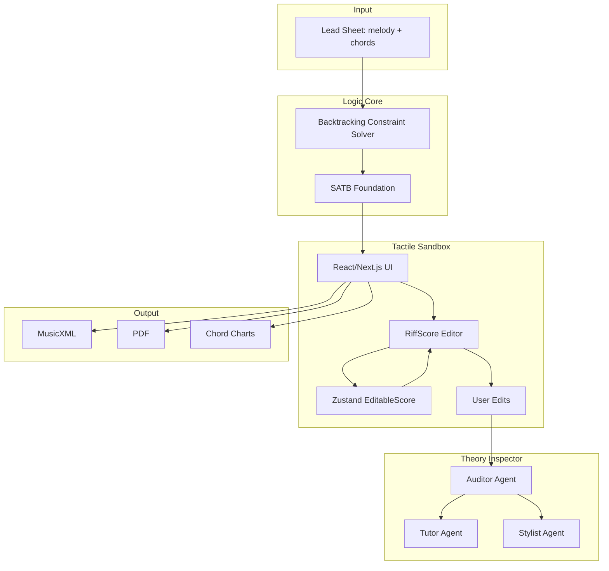

# System Map

> **Topology (2026-06-03):** **HarmonyForge is one Next.js app.** The SATB engine lives inside the same process at `frontend/src/server/engine/*` and is reached via `/api/*` route handlers (no separate Express on `:8000`, no `NEXT_PUBLIC_API_URL`, no CORS routing). A root `Dockerfile` bundles Node + **Audiveris** (Java 25) for self-hosted PDF OMR; Vercel serves everything except PDF → MusicXML. See **[docs/deployment.md](../deployment.md)** for both targets.
>
> **Implementation status:** Logic Core (`frontend/src/server/engine/`) complete. Flow: Document (**editable** preview) → `POST /api/generate-from-file` (live staff when sounding notes changed) → Sandbox. **`POST /api/to-preview-musicxml`** — intake → preview MusicXML for **PDF / MXL / MIDI** (Playground stores result in **`useUploadStore.previewMusicXML`**). **PDF → MusicXML:** Playground **`rasterizePdf`** → FormData **`pages`**; server tries **`intakeImagePagesToParsedScore`** first, then **Audiveris** on PDF buffer ([`audiverisPipeline.ts`](../frontend/src/server/engine/parsers/audiverisPipeline.ts)) with **raster-first** for photo PDFs ([`pdfServerRaster.ts`](../frontend/src/server/engine/parsers/pdfServerRaster.ts), **`@napi-rs/canvas`** + **`serverExternalPackages`** in `next.config.ts`). Local **`make audiveris-setup`** (Audiveris **5.9.0**; **`make dev`** exports **`AUDIVERIS_BIN`**) or self-hosted Docker. **Remaining gaps:** E2E photo-PDF QA on real scans; OMR **accuracy**; optional full browser QA matrix — **[progress.md — Session 2026-08-14](../progress.md#wl-session-2026-08-14)**. **Toolbar transpose:** synchronous **`peekTransposeTargetNoteIds`** + **`readLiveScore`** ([`sandboxScoreTranspose.ts`](../frontend/src/lib/sandbox/sandboxScoreTranspose.ts)). **Additive harmonies** preserved in output. **Clefs:** Engine `satbToMusicXML.ts` emits per-part `<clef>` from instrument name + SATB voice; frontend `musicxmlParser.ts` infers clef from part name **before** fixed `P1–P4` defaults. **Theory sources in code/docs:** `docs/Taxonomy.md` + `frontend/src/lib/ai/taxonomyIndex.ts` define **Open Music Theory** (primary RAG pedagogy), **Aldwell & Schachter** (hard SATB constraints in `constraints.ts` / trace), **Fux** (motion heuristic **lineage** only—`solver.ts` uses L1 MIDI sum, not species counterpoint), **Caplin** (vocabulary; no full segmentation in primary `engine/`). **Sandbox editor (current):** **RiffScore** in `frontend/` with **`EditableScore`** in Zustand; `riffscoreAdapter` + `useRiffScoreSync` + `normalizeScoreRests`. **RiffScore forkless extension:** `patch-package` applies `patches/riffscore+*.patch` — **`ui.toolbarPlugins`** (plugin button state props) **and** **playback alignment** for scrub: **`globalThis.__HF_RIFFSCORE_PLAY_FROM`**, **`consumeHfRiffScorePendingPlay()`** in **`handlePlayToggle`** / **`handlePlayback`** (toolbar **Play**, **Space**, **P**); HarmonyForge **`PlaybackScrubOverlay`**, **`playbackScrub.ts`**, **`riffscorePlaybackBridge.ts`** (see **`@docs/progress.md` → Playback scrub**). **Legacy:** VexFlow/OSMD paths still exist in repo history and some preview surfaces; **primary editing path is RiffScore.** **Theory Inspector:** `/api/theory-inspector` (+ `theoryInspectorNoteMode` for note-click tutor), `/api/theory-inspector/suggest`; **fixed LLM audience depth** — **`intermediate`** via **`frontend/src/lib/ai/explanationLevel.ts`** (**`DEFAULT_EXPLANATION_LEVEL`**, **`resolveExplanationLevel`**; no Beginner/Intermediate/Professional toggle in UI or Zustand); **`POST /api/validate-satb-trace`** for trace-backed highlights; **dual-mode** Origin Justifier vs Harmonic Guide vs melody-context (`theoryInspectorMode.ts`, `Note.originalGeneratedPitch` + Zustand baseline)—**UI:** tutor summary, **What the tool first wrote**, **What this click means** (short prose), **Verifiable score export** (FACT monospace block). **Note-click LLM:** streamed text split in **`noteInsightAiSplit.ts`** into **`aiExplanation`** + **`aiSuggestions`** after delimiter `<<<SUGGESTIONS>>>`. **Free-form chat:** same panel + composer; **`streamingMessageId`** for chat-only typing. **Editor focus + text “score view” for LLM:** **`InspectorScoreFocus`** → **`sendMessage`** POSTs **`scoreSelectionContext`** and **prepends** FACT text to the **user message**; **`buildSystemPrompt`** appends **Editor focus**. **Follow-up fix (2026-04-04):** **`conversationHistory`** built **before** adding the new user bubble—avoids **two consecutive `user`** API messages (plain then full export). **Note-click tutor** POSTs **`userMessage`** = **exported notation first**, then **Response rules**. No staff images—structured strings only. **Markdown:** **`react-markdown`** via **`MarkdownText.tsx`** in **`ChatBubble`** (user/ai) and key **`TheoryInspectorPanel`** blocks. **Region FACTs:** **`regionExplainContext.ts`**. **Canvas:** **Bars** strip + **clickable staff labels** → **`selectAll`**, **green** **focus** overlays. **`TheoryInspectorPanel`:** **This measure** / **This part** card. **`noteExplainContext.ts`** — roster, vertical snapshot, **intervals**, **`describeNotationForTutor`**, **full-bar appendix**; **5+ staves** additive. **`runAudit`** still four-staff mapping without `requireExactlyFourParts`. **Dark theme:** **`ChatBubble`** + **`SandboxPlaybackBar`** use **`hf-*`** tokens. **`lib/ai/prompts.ts`** — **`CITATION_AND_BREVITY`** + **`HONESTY_NO_SYCOPHANCY`**. **Panel scroll:** **`useLayoutEffect` (no deps)**. **Tests:** vitest (`noteExplainContext`, `noteInsightAiSplit`, `regionExplainContext`). **Risks:** residual LLM variance / stale focus; **PDF OMR** fragile; RiffScore **404** samples; **`make lint-frontend`** debt. See **`@progress.md`** **Work log — Tutor follow-up + panels + markdown (2026-04-04)** and earlier LLM / editor-focus logs.

## Overview

HarmonyForge is a three-stage Glass Box architecture for symbolic music arrangement.

**Repository layout (2026-04-19):**
- `frontend/` — Single Next.js app housing the UI, the SATB engine (`src/server/engine/**`), and route handlers (`src/app/api/**`). `patch-package` augments `riffscore`.
- `Dockerfile` (repo root) + `docker-compose.yml` — Optional self-hosted image bundling Node + **Java 25 + Audiveris** for PDF OMR.
- `scripts/audiveris/` — Local Audiveris setup (`make audiveris-setup`) and manual QA convert (`make audiveris-convert`).
- `docs/` — Plan, progress, ADRs, context, `Taxonomy.md`, deployment guide.
- `miscellaneous/` — Vendored `pdfalto/` build + small tooling (see [miscellaneous/README.md](../../miscellaneous/README.md)).
- **`docs/Taxonomy.md`** — RAG lexicon; **source spine** maps treatises to **engine behavior** vs pedagogy-only; mirrored in `frontend/src/lib/ai/taxonomyIndex.ts`; LLM **`prompts.ts`** — concise citations + **non-sycophantic** honesty when `OPENAI_API_KEY` is set.

```mermaid
flowchart TB
    subgraph input [Input]
        LeadSheet[Lead Sheet: melody + chords]
    end

    subgraph logic [Logic Core]
        Solver[Backtracking Constraint Solver]
        SATB[SATB Foundation]
    end

    subgraph sandbox [Tactile Sandbox]
        UI[React/Next.js UI]
        RiffScore[RiffScore Editor]
        Zustand[Zustand EditableScore]
        Edits[User Edits]
    end

    subgraph explain [Theory Inspector]
        Auditor[Auditor Agent]
        Tutor[Tutor Agent]
        Stylist[Stylist Agent]
    end

    subgraph output [Output]
        MusicXML[MusicXML]
        PDF[PDF]
        ChordCharts[Chord Charts]
    end

    LeadSheet --> Solver
    Solver --> SATB
    SATB --> UI
    UI --> RiffScore
    RiffScore --> Zustand
    Zustand --> RiffScore
    RiffScore --> Edits
    Edits --> Auditor
    Auditor --> Tutor
    Auditor --> Stylist
    UI --> MusicXML
    UI --> PDF
    UI --> ChordCharts
```

## Components

| Component | Role | Tech |
|-----------|------|------|
| **Logic Core** | Deterministic constraint-satisfaction solver; generates valid SATB from lead sheet; variable parts (selected instruments only). **Intake:** `intakeFileToParsedScore` (MusicXML/MXL/MIDI/PDF). **APIs:** `generate-from-file`, **`to-preview-musicxml`** (preview MusicXML for Document). **PDF OMR:** **Audiveris** (Java 25; local **`make audiveris-setup`** or Docker). | Node.js, TypeScript |
| **Tactile Sandbox** | **RiffScore**-centric notation editor; `EditableScore` ↔ RiffScore sync; rest normalization; native toolbar plugins + **scrub-to-play** bridge (patched `riffscore` + `PlaybackScrubOverlay`). **`patch-package`** corrects **alto/tenor C-clef** vertical note placement via **`getOffsetForPitch` / `getPitchForOffset`** (upstream used treble offsets for common pitches); layout hunks **re-shipped 2026-06-03** after patch drift — see **[progress.md — Viola parity](../progress.md#wl-viola-sandbox-export-parity-2026-06-03)**. **(2026-08-14 PM)** `Staff3.renderTies` uses **`staffLayout` measure widths** + **`forcedPositions`** so tie arcs share X with noteheads; RS→HF flush **`mergeNotationFromPrevious`** keeps palette marks — **[Session 2026-08-14 PM](../progress.md#wl-session-2026-08-14-pm)**. Keeps **CJS `index.js`** in sync with **ESM `index.mjs`** for **`toolbarPlugins`** / single-staff transition behavior. Session persistence; onboarding tour. **Note:** RiffScore built-in playback may 404 on `/audio/piano/*.mp3` until static assets exist; **dual Tone paths** (API vs internal `playScore`) — scrub uses pending global consumed on play. **Lives in** `frontend/` | Next 16, React 19, Tailwind, RiffScore, Zustand, patch-package |
| **Theory Inspector** | **Note explain** + **free-form chat** in one panel (`messages` + composer); **QuickReplyChips** only when present in message history. SATB audit via **`/api/validate-satb-trace`** + local fallback; **harmony-only** highlights/suggest; note-click: **What the tool first wrote**, **What this click means** (short prose from `describeNotationForTutor`), **Verifiable score export** (FACT lines), **Tutor summary**, **Ideas to try next** (`aiSuggestions` / `noteInsightAiSplit.ts`); tutor `theoryInspectorNoteMode`. **Audience depth:** fixed **`intermediate`** for LLM prompts (**`DEFAULT_EXPLANATION_LEVEL`**, **`resolveExplanationLevel`** on **`/api/theory-inspector`** + **`/suggest`**); **no** Beginner/Intermediate/Professional UI toggle or Zustand **`explanationLevel`**. **LLM “view” of score:** **text export**—**`SCORE_DIGEST`**, **`FACT: AUTHORITATIVE NOTATION`**, **`FULL BAR`**; **note stream** = evidence **before** response rules; **follow-up chat** **prepends** FACT block and uses **`conversationHistory` without the in-flight user message** (2026-04-04) so the API is not sent two consecutive `user` turns. **Editor focus:** **`inspectorScoreFocus`** + **`scoreSelectionContext`** + **Editor focus** in **`prompts.ts`**; **measure/part** from **`regionExplainContext.ts`**; **This measure / This part** card. **Markdown:** **`MarkdownText.tsx`** (`react-markdown`) for chat bubbles + tutor blocks. RAG + **`CITATION_AND_BREVITY`** + **`HONESTY_NO_SYCOPHANCY`**. **`streamingMessageId`** → chat-only typing. **2026-04-06:** **Split column** (note stack + ideas vs chat; chat-only autoscroll); optional **`<<<IDEA_ACTIONS>>>`** JSON for one-click applies; **`NOTE_IDS_FOR_IDEA_ACTIONS`** + **`resolveIdeaActionNoteId`** when JSON `noteId` is wrong; stylist/input **pitch labels** on ghosts. Panel autoscroll: **`useLayoutEffect` without deps** (chat pane only for split layout). **Risk:** residual model/stale-focus + ambiguous idea-action resolution—see **`@progress.md`** → [Theory Inspector work log](../progress.md#wl-inspector-split-ideas-2026-04-06). | Next.js API routes, `docs/Taxonomy.md`, `taxonomyIndex.ts`, `explanationLevel.ts`, `useTheoryInspector.ts`, `useTheoryInspectorStore.ts`, `TheoryInspectorPanel.tsx`, `MarkdownText.tsx`, `ideaActionSchema.ts`, `noteInsightAiSplit.ts`, `ideaActionResolve.ts`, `regionExplainContext.ts`, `noteExplainContext.ts`, `theoryInspectorBaseline.ts`, `theoryInspectorSlots.ts`, `prompts.ts`, `ChatBubble.tsx`, `SandboxPlaybackBar.tsx`, `RiffScoreSuggestionOverlay.tsx`, `staffPreviewPitch.ts` |
| **RiffScore canvas (labels + inspector chrome)** | Maps each rendered staff to **`EditableScore.parts[].name`** via SVG `g.staff` geometry; fallback list if layout mismatch. With Theory Inspector open: **Bars** strip (measure focus), **clickable** part labels (whole-part focus), **green focus highlights** for selected region note ids. | `riffscorePositions.ts` (`extractStaffLabelLayout`), `RiffScoreEditor.tsx`, `ScoreCanvas.tsx` |

## Data Flow

1. **Input**: User uploads **MusicXML (.xml/.musicxml), MXL, MIDI, or PDF** (dropzone). Playground rasterizes PDFs client-side and posts **`pages`** PNGs with the file. **`resolveParsedScore`** (`runtime.ts`) runs **image-page OMR first** for PDF, else **`intakeFileToParsedScore`** (`fileIntake.ts`): ZIP sniff, extension routing; **PDF** → **Audiveris** via **`audiverisPipeline.ts`** (photo PDFs **raster-first** with **`pdfServerRaster.ts`**). Requires **`make audiveris-setup`** locally or Docker image. See [deployment.md](../deployment.md) for Vercel vs Docker capability gaps.
2. **Document page**: **`.xml`/`.musicxml`:** FileReader → `parseMusicXML` → ScorePreviewPanel (**editable** RiffScore; native notation strip; does **not** write sandbox `useScoreStore`). **`pdf`/`.mxl`/`.mid`/`.midi`:** Playground already called **`POST /api/to-preview-musicxml`**; preview string in **`useUploadStore.previewMusicXML`**; Document parses like XML when present. If preview intake fails, user sees error on Playground (in-page panel) and file is cleared. Right pane: Ensemble Builder → **Generate Harmonies** → **`POST /api/generate-from-file`** with **live staff MusicXML** when sounding notes differ from intake, else original preview XML / file ([`resolveMelodyXmlForGeneration.ts`](../../frontend/src/lib/music/resolveMelodyXmlForGeneration.ts)).
3. **Parse & normalize**: Backend converts to canonical format (ParsedScore); extracts melody, `melodyPartName`, key, chords (or infers chords using mood). fast-xml-parser for score-partwise (avoids DTD loading).
4. **Generation**: Backend solver processes ParsedScore + config (mood affects chord inference) → outputs valid SATB. **Additive harmonies:** melody stays as Part 1; selected instruments (flute, cello) added as harmony parts (Alto, Bass voices).
5. **Output**: Backend returns **partwise MusicXML 2.0** (melody + harmony parts, MuseScore/OSMD compatible) for Tactile Sandbox / note editor.
6. **Frontend (Sandbox):** Generated MusicXML → parsed → `EditableScore` → **RiffScore** display/edit; changes pulled back into Zustand. Session persistence for `generatedMusicXML`; CORS configurable.
7. **Explainability:** **Free-form chat** (composer) or legacy chip-driven flows → `/api/theory-inspector` (optional stream) with **`getTaxonomyContext`**; body may omit **`explanationLevel`** — server uses **`resolveExplanationLevel`** (**`intermediate`** default); **`sendMessage`** includes **`scoreSelectionContext`** (and **`theoryInspectorNoteMode`** when focus is a **note**) built from **`inspectorScoreFocus`**; **system prompt** includes **Editor focus** when that string is non-empty; **user message** for chat **prepends** the same FACT block. **`conversationHistory`** for chat is snapshotted **before** the new user message is stored (2026-04-04) so the OpenAI message list does not end with a **plain** user turn immediately before the **enriched** user turn. SATB audit/highlights prefer **`POST /api/validate-satb-trace`**; structured fixes via `/api/theory-inspector/suggest` when API key present; **harmony note click** → baseline + `originalGeneratedPitch` gate → dual-mode FACTs + **`SCORE_DIGEST` / AUTHORITATIVE / FULL BAR** → **Tutor** stream: **notation export first**, then rules → split into **summary** + **suggestions** (`<<<SUGGESTIONS>>>`); **measure / part** focus → **`buildMeasureFocusFacts` / `buildPartFocusFacts`** + green **focus** overlays. Panel: **Tutor summary** / **Ideas** / origin / **What this click means** / **Verifiable score export** **above** chat list; **This measure / This part** when region-focused. **`MarkdownText`** renders `**bold**` etc. in chat and key panels. `noteExplainContext` **staff roster**, intervals, **full-bar dump**. **Gaps:** (a) Roman-numeral per slot not on client; (b) audit vs 5+ staves; (c) Mode A rationale thin without engine metadata; (d) offline = taxonomy fallback; (e) scroll-every-render tradeoff; (f) **PDF→MusicXML** / **oemer**; (g) **residual tutor quality** (stale focus if user edits after click; optional live evidence refresh on send not implemented).
8. **Export (2026-04-13; OSMD PDF 2026-06-04):** From **`/sandbox`** **`ExportModal`** — **live** score after **`flushToZustand`**. **Primary formats:** **PDF** (preview + print), **MusicXML**, **WAV**, **MIDI** ([`exportFormats.ts`](../../frontend/src/lib/sandbox/exportFormats.ts)). **PDF preview** ([`ScorePreviewPane`](../../frontend/src/components/molecules/ScorePreviewPane.tsx)) and **Print** ([`ExportPrintRoot`](../../frontend/src/components/organisms/ExportPrintRoot.tsx) → [`PrintableScore`](../../frontend/src/components/score/PrintableScore.tsx)) both use **`renderOsmdExportScore`** (OSMD). Optional **letter names** on PDF preview + print when **`showNoteNameLabels`** — [`osmdLearnerLabels.ts`](../../frontend/src/lib/music/osmdLearnerLabels.ts) (SVG in VexFlow note groups). **Branding:** [`exportBranding.ts`](../../frontend/src/lib/sandbox/exportBranding.ts). **Dual render paths:** OSMD is clef-accurate; RiffScore canvas depends on **`patch-package`** alto/tenor layout — see **[Viola parity](../progress.md#wl-viola-sandbox-export-parity-2026-06-03)** and **[Export + OSMD labels 2026-06-04](../progress.md#wl-export-osmd-learners-2026-06-04)**.

## Entry Points

- **API**: REST endpoints for solver (POST lead sheet → SATB JSON).
- **UI** (`frontend/src/app/`): Three-step flow — `/` Playground (upload) → `/document` Config (mood, instruments) → `/sandbox` Edit (ScoreCanvas, Theory Inspector, Export). Upload, generate, edit, export.
- **Theory Inspector**: Triggered by symbolic state changes; user queries flagged notes. RAG: `docs/Taxonomy.md` + `taxonomyIndex.ts` (genre sections + violation entries; source–engine mapping in classical blob). LLM: `prompts.ts` — `CITATION_AND_BREVITY` + `HONESTY_NO_SYCOPHANCY` when API key present.
