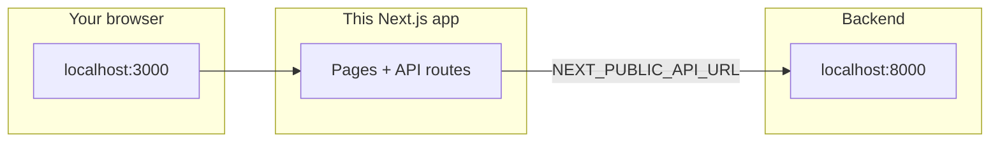

# Frontend — Tactile Sandbox

> **This folder is the website:** Next.js app where you upload music, configure generation, edit the score, and use the **Theory Inspector**.  
> The **harmony engine** lives in `../backend/` — the browser calls it over HTTP.

---

## At a glance

| Topic | Summary |
|-------|---------|
| **Stack** | Next.js (App Router), **RiffScore** as the main editor, Zustand for state |
| **Default URLs** | App **:3000**, engine **:8000** (when you use `make dev` from repo root) |
| **AI features** | Optional; need `OPENAI_API_KEY` in `.env.local` for full inspector |

---

## Run the app

**Recommended (full stack from repo root):**

```bash
cd ..                    # repo root
make install             # once
make dev                 # engine + this app
```

Open **http://localhost:3000**.

**Frontend only** (you must already have the engine running separately):

```bash
cd frontend
npm install
npm run dev
```



---

## Environment variables

1. Copy **`.env.example`** → **`.env.local`** (same folder as this README).
2. Never commit `.env.local` — it is git-ignored.

| Variable | Who reads it | Meaning |
|----------|--------------|---------|
| `OPENAI_API_KEY` | Server (API routes) | Powers Theory Inspector LLM calls; leave empty to use offline fallbacks where supported |
| `OPENAI_BASE_URL` / `OPENAI_URL` | Server | Custom OpenAI-compatible API base |
| `OPENAI_MODEL` | Server | Optional model override |
| `NEXT_PUBLIC_API_URL` | **Browser** | Base URL of the engine (default `http://localhost:8000`) |
| `NEXT_PUBLIC_*` study vars | Browser | M5 user-study toggles — see [docs/plan.md](../docs/plan.md) (M5 section) |

> **`NEXT_PUBLIC_*` is public.** Do not put secrets there; anything with that prefix ships to the client bundle.

---

## Routes (pages)

| URL | What you see |
|-----|----------------|
| `/` | Playground: upload, onboarding modal, link to product tour |
| `/onboarding` | Same upload flow; onboarding always available (good for demos) |
| `/document` | Preview score, mood + instruments, **Generate** |
| `/sandbox` | Score editor, playback, export, **Theory Inspector** |

**Server APIs** live under `src/app/api/` (theory inspector, preview helpers, proxies to the engine, etc.).

---

## Where things live in `src/`

```text
src/
├── app/           Pages, layouts, route handlers (API)
├── components/    UI building blocks and screens
├── lib/           AI clients, study config, music helpers
├── store/         Zustand (upload, score, inspector, …)
└── hooks/         Playback, RiffScore sync, etc.
```

| Area | Think of it as… |
|------|------------------|
| `app/` | URLs and server endpoints |
| `components/` | Everything visible on screen |
| `store/` | Single source of truth for the score (**`EditableScore`**) |
| `hooks/` | Glue between RiffScore UI and the store |

**Score truth:** **`EditableScore`** in the store is canonical; **`useRiffScoreSync`** keeps the RiffScore widget and the store in sync.

---

## RiffScore patch

The **`riffscore`** package is modified with **`patch-package`** (`patches/` + `postinstall` in `package.json`). After upgrading RiffScore or changing patches, run **`npm install`** again so patches apply.

---

## Test and build

```bash
cd frontend
npm run test     # Vitest
npm run build    # Production build
```

From repo root, **`make build`** also builds the engine and this app.

---

## More reading

| Doc | Use when… |
|-----|-----------|
| [../docs/plan.md](../docs/plan.md) | You need the feature checklist and manual verification steps |
| [../docs/progress.md](../docs/progress.md) | You need recent decisions and known issues |
| [../docs/README.md](../docs/README.md) | You want the full documentation index |
